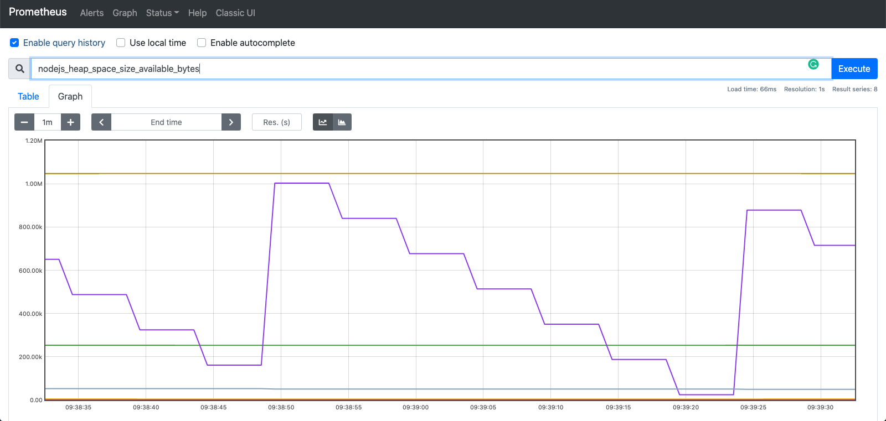

### Create `prometheus.yml` 

```yaml
global:
  scrape_interval: 5s
scrape_configs:
  - job_name: "nodejs-app"
    static_configs:
      - targets: ["host.docker.internal:8080"]
```


### Run prometheus with custom configuration

```bash
# Ensure that correct yaml file is mounted to /etc/prometheus/prometheus.yml
docker run \
    -p 9090:9090 \
    -v $(pwd)/prometheus.yml:/etc/prometheus/prometheus.yml \
    prom/prometheus
```

Check dashboard at [http://localhost:9090](http://localhost:9090)


### Run a query 

- In prometheus dashboard, type `nodejs_heap_space_size_available_bytes` in search and enter




### Persist data

If we restart the prometheus server, we will loose the time series data it captured. To fix this we will mount a local dir to prometheus container where it can persist data and reload on next run : 

```bash
# Create a prometheus dir 
mkdir -p prometheus/data
mv prometheus.yml prometheus/prometheus.yml

docker run \
    -p 9090:9090 \
    -v $(pwd)/prometheus/:/etc/prometheus\
    prom/prometheus \
    --config.file=/etc/prometheus/prometheus.yml \
    --storage.tsdb.path=/prometheus/data
```

