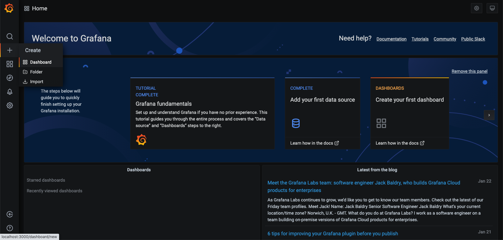
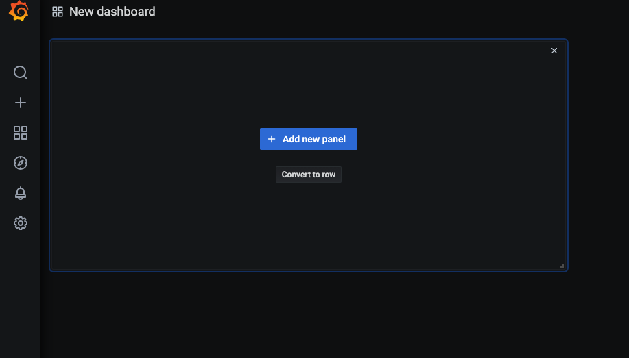
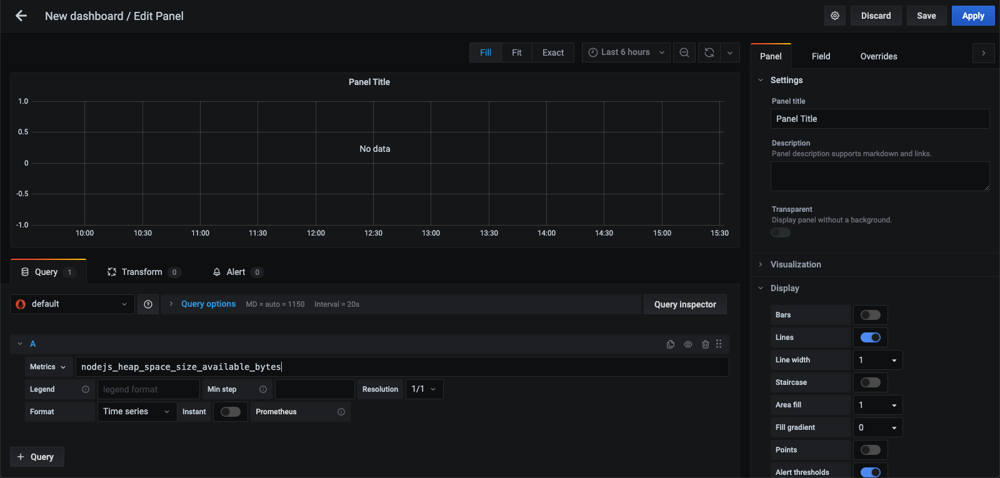
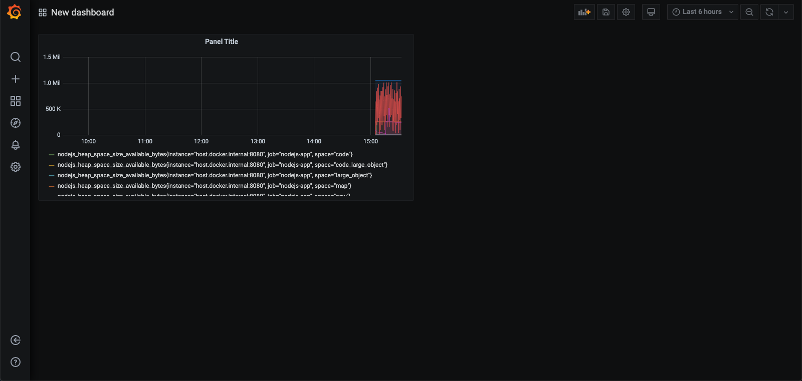

**Create data sources configuration for grafana** 

- Create file `grafana-data-sources.yml`

```yaml
#grafana-data-sources.yml

apiVersion: 1
datasources:
  - name: Prometheus
    type: prometheus
    access: proxy
    orgId: 1
    # Address of our prometheus server 
    url: http://host.docker.internal:9090
    basicAuth: false
    isDefault: true
    editable: true
```


### Run grafana as docker container : 

```bash
# Run as docker container without login pages

docker run --rm -p 3000:3000 \
  -e GF_AUTH_DISABLE_LOGIN_FORM=true \
  -e GF_AUTH_ANONYMOUS_ENABLED=true \
  -e GF_AUTH_ANONYMOUS_ORG_ROLE=Admin \
  -v $(pwd)/grafana-data-sources.yml:/etc/grafana/provisioning/datasources/datasources.yml \
  grafana/grafana
```

Open http://localhost:3000/ to verify 




### Create dashboard

- Click on `+` icon on left panel and select dashboard

- Click on add new panel : 

  


- Add metric `nodejs_heap_space_size_available_bytes`
	


- Click on `Apply` button on top right

  


### Persist data

If we restart the docker container, we will loose the created dashboards and panels. To prevent this, we will mound a dir from local disk where grafana can save the data 

```bash
# Create data dir
mkdir -p grafana/data
mv grafana-data-sources.yml grafana/data-sources.yml

# Run image with mounted volume
docker run -p 3000:3000 \
	-v $(pwd)/grafana/data:/var/lib/grafana \
  -e GF_AUTH_DISABLE_LOGIN_FORM=true \
  -e GF_AUTH_ANONYMOUS_ENABLED=true \
  -e GF_AUTH_ANONYMOUS_ORG_ROLE=Admin \
  -v $(pwd)/grafana/data-sources.yml:/etc/grafana/provisioning/datasources/datasources.yml \
	grafana/grafana:7.3.7
```


Now we can restart grafana without loosing data.