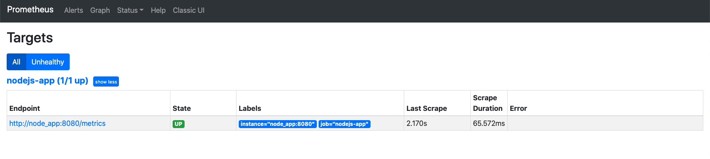

### Dokerize app 

- creat file `Dockerfile`: 

  ```dockerfile
  FROM node:14
  
  RUN mkdir -p /app
  
  COPY package.json /app
  COPY yarn.lock /app
  WORKDIR /app
  
  RUN yarn
  
  COPY index.js /app
  
  EXPOSE 8080
  CMD [ "yarn", "start" ]
  ```

  

- Update `prometheus.yml` to use the service `node_app` that we will configure from `docker-compose.yaml`

  ```diff
   global:
     scrape_interval: 5s
   scrape_configs:
     - job_name: "nodejs-app"
       static_configs:
  -      - targets: ["host.docker.internal:8080"]
  +      - targets: ["node_app:8080"]
  ```


- Create file  `docker-compose.yaml`

  ```yaml
  
  services:
    prometheus:
      image: "prom/prometheus:v2.24.1"
      ports:
        - 9090:9090
      volumes:
        - ./prometheus:/etc/prometheus
      command:
        - "--config.file=/etc/prometheus/prometheus.yml"
        - "--storage.tsdb.path=/etc/prometheus/data"
      depends_on:
        - node_app
  
    node_app:
      build:
        context: ./
      ports:
        - "8080:8080"
  ```

  

- Now run docker-compose to check if prometheus is working

  ```bash
  docker-compose -f ./docker-compose.yml up --build
  ```

  

- Check the page http://localhost:9090/targets to ensure prometheus is running and can reach out node app.

  


- Similarly update the grafana.yml

  ```
  
  ```

  