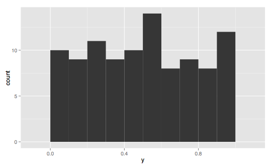

see : https://github.com/siimon/prom-client


### Apply label to all metrics 

```javascript
const defaultLabels = { version: 'v1' };
registry.setDefaultLabels(defaultLabels);
```


Now check the http://localhost:8080/metrics, all metrics will have this label

For e.g. this is useful when we need to keep the kubernetes pod name/ cluster name 

```diff
- process_cpu_user_seconds_total 0.028964
+ process_cpu_user_seconds_total{version="v1"} 0.028964
```


### Add a counter metric

```javascript
  // Add a counter that increments every second
  // Counters can increase only
  const counter = new client.Counter({
    name: 'second_increment',
    help: 'Custom: This increments every seconds and then resets at 10 seconds',
  });
  setInterval(() => counter.inc(10), 1000);
  setInterval(() => counter.reset(), 10000);

  registry.registerMetric(counter);
```


Published as : 

```properties
# HELP second_increment This increments every seconds and then resets at 10 seconds
# TYPE second_increment counter
second_increment{version="v1"} 50
```


### Add a Gauge metric

```javascript
// Add a gauge metric
// This can increase or decrease
const gauge = new client.Gauge({
  name: 'custom_gauge',
  help: 'Custom: This increments every 1 second, reduces every 5 seconds by 2 and resets every 10 seconds'
});

setInterval(() => gauge.inc(1), 1000);
setInterval(() => gauge.dec(10), 5000);
setInterval(() => gauge.set(0), 10000);

registry.registerMetric(gauge);
```


This is published as: 

```properties

# HELP custom_gauge Custom: This increments every 1 second, reduces every 5 seconds by 2 and resets every 10 seconds
# TYPE custom_gauge gauge
custom_gauge{version="v1"} -8
```


### Histogram

- Histograms track sizes and frequency of events.

- **histogram** is an approximate representation of the [distribution](https://en.wikipedia.org/wiki/Frequency_distribution) of numerical data

  

```

```


This is published as : 

```properties
# HELP custom_historgram_no_buckets Custom: Random values in histogram with no buckets
# TYPE custom_historgram_no_buckets histogram
custom_historgram_no_buckets_bucket{le="0.005",version="v1"} 581
custom_historgram_no_buckets_bucket{le="0.01",version="v1"} 581
custom_historgram_no_buckets_bucket{le="0.025",version="v1"} 581
custom_historgram_no_buckets_bucket{le="0.05",version="v1"} 581
custom_historgram_no_buckets_bucket{le="0.1",version="v1"} 581
custom_historgram_no_buckets_bucket{le="0.25",version="v1"} 581
custom_historgram_no_buckets_bucket{le="0.5",version="v1"} 581
custom_historgram_no_buckets_bucket{le="1",version="v1"} 1107
custom_historgram_no_buckets_bucket{le="2.5",version="v1"} 1642
custom_historgram_no_buckets_bucket{le="5",version="v1"} 3367
custom_historgram_no_buckets_bucket{le="10",version="v1"} 6197
custom_historgram_no_buckets_bucket{le="+Inf",version="v1"} 56896
custom_historgram_no_buckets_sum{version="v1"} 2815207
custom_historgram_no_buckets_count{version="v1"} 56896
```

