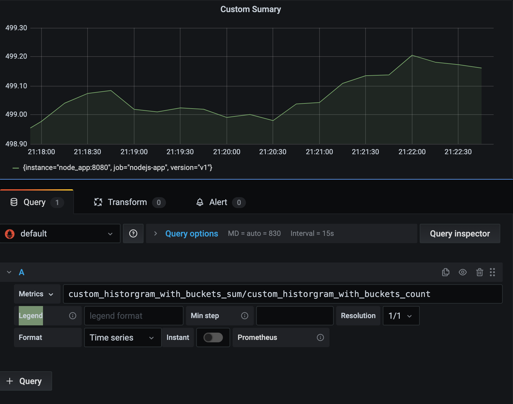

**Historgram as sum** : 

- Note that the number of observations (showing up in Prometheus as a time series with a `_count` suffix)

- The sum of observations (showing up as a time series with a `_sum` suffix)

- For example if the metric is define as 

  ```javascript
  const histogramWithBucket = new client.Histogram({
    name: 'custom_historgram_with_buckets',
    help: 'Custom: Random values in histogram with buckets',
    percentiles: [0.1,0.25, 0.5, 0.9, 0.99],
  });
  setInterval(
    () => histogramWithBucket.observe(Math.floor(Math.random() * 1000))
  );
  ```

  

- Then use following query to get average values over time : 

  ```
  custom_historgram_with_buckets_sum/custom_historgram_with_buckets_count
  ```

  

  


Average value by label

```
```

