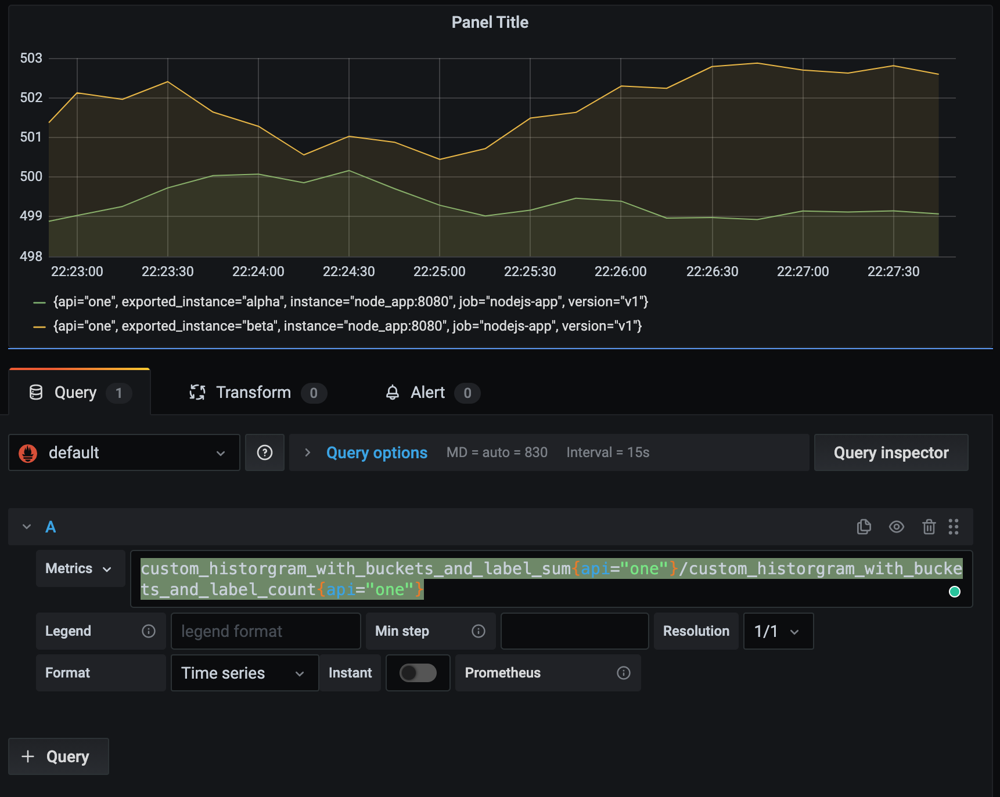
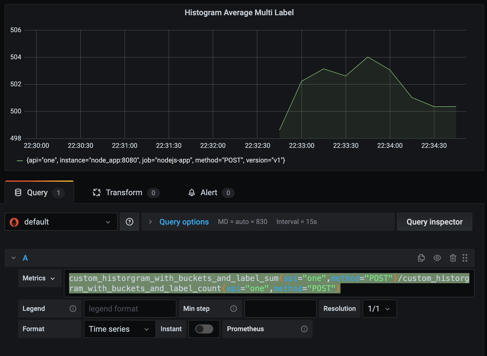

- Consider metric defined as : 

  ```javascript
   // Add a histogram with buckets
  const histogramWithBucketAndLabel = new client.Histogram({
    labelNames: ["api", "method"],
    name: 'custom_historgram_with_buckets_and_label',
    help: 'Custom: Random values in histogram with buckets "percentiles: [0.1,0.25, 0.5, 0.9, 0.99]"',
    percentiles: [0.1,0.25, 0.5, 0.9, 0.99],
  });
  setInterval(
    () => {
      const method = Math.random() > 0.25 ? "POST": "GET";
      const api = Math.random() > 0.5 ? "one": "two";
      const labels = {api, method};
      histogramWithBucketAndLabel.observe(labels, Math.floor(Math.random() * 1000))
    }
  );
  ```

  

- create historgram and view labels as separate cureve : 

  ```yaml
  custom_historgram_with_buckets_and_label_sum{api="one"}/custom_historgram_with_buckets_and_label_count{api="one"}
  ```

  > Here instance is not specified, so we see two curves for each instance value in visualization : 

  

  


- Create chart by multiple label: 

  ```yaml
  custom_historgram_with_buckets_and_label_sum{api="one",method="POST"}/custom_historgram_with_buckets_and_label_count{api="one",method="POST"}
  ```

  

